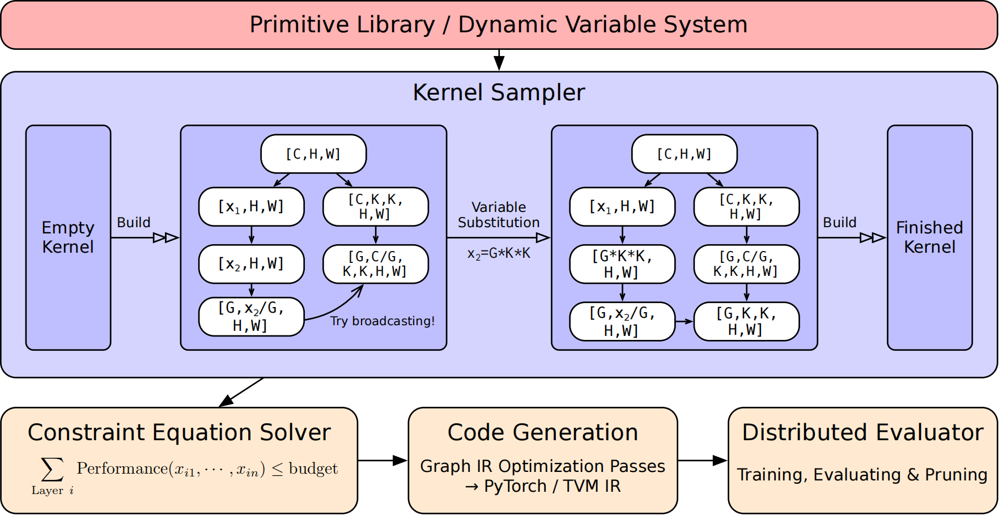

<h2 class="col">
Biography
</h2>

I'm a senior undergraduate student at <a href="https://www.purdue.edu/">Purdue University</a> Right now I'm fortunate to work with <a href="https://www.wang-yuke.com/about-me">Yuke Wang</a> at Rice University. I also contribute to <a href="https://github.com/sgl-project/sglang">SGLang</a> part-time. Previously, I was a research intern at Shanghai Qi Zhi Institute(founded by Turing Award Laureate, Prof. Andrew Chi-Chih Yao), fortunate to work with <a href="http://people.iiis.tsinghua.edu.cn/~gaomy/">Mingyu Gao</a> at Tsinghua University.

My research interest focuses on building hardware-efficient and reliable systems and architecture for emerging workloads, specifically in the following topics:
<ul>
    <li>System and Architecture for AI and Science.</li>
    <li>Edge Computing.</li>
</ul>

I am applying for the 2025 Fall Ph.D. program in Computer Science focused on maching learning infrastructure and traditional core systems and architecture. Please reach out if you think I am a good candidate!   `shen634[at]purdue[dot]edu`
<h2 class="col">
Publications
</h2>

<h3 style="font-size: 18px; font-weight: bold; margin-bottom: 10px;">

A LLM serving system (Under Review in ATC 25)

</h3>

<b>A. Shen</b>*, Z. Li, M. Gao

<h3 style="font-size: 18px; font-weight: bold; margin-bottom: 10px;">

Canvas: End-to-End Kernel Architecture Search in Neural Networks

</h3>

C. Zhao,  G. Zhang, <b>A. Shen</b>, M. Gao

<a href="https://arxiv.org/abs/2304.07741" style="text-decoration: none; color: #52ADC8;">Arxiv</a> available.

<h2 class="col">
Misc
</h2>

<ul>
    <li>Workout. I exercise in my spare time after work, which gives me more energy for my job.</li>
    <li>Cook. I cook for myself in my spare time after work, as it is a way to nurture both body and mind.</li>
    <li>Stock. I do non-ferrous metals, which helps me adopt a long-term mindset, resulting in an annualized return of around 20% over the past three years in A-share - recognized as one of the most challenging markets globally.</li>
</ul>